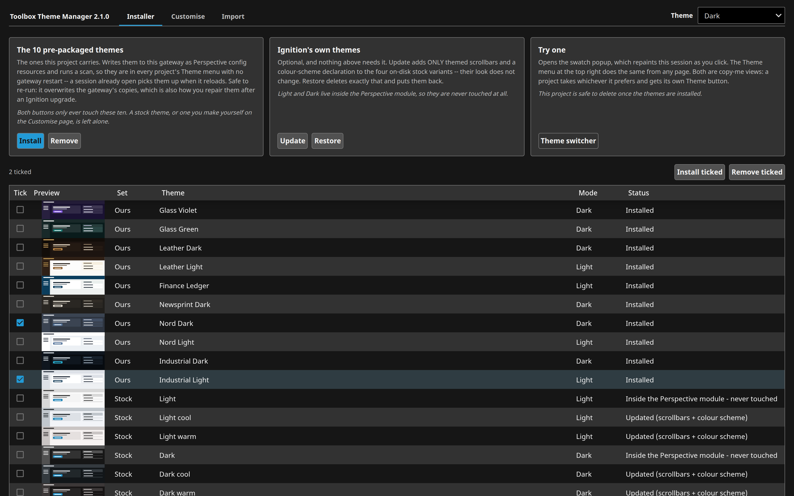
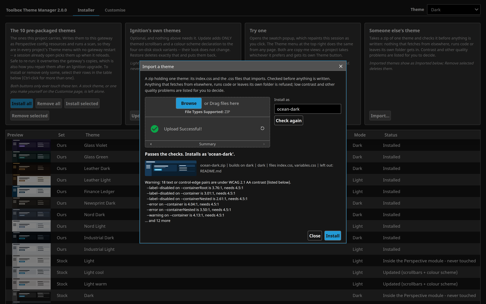
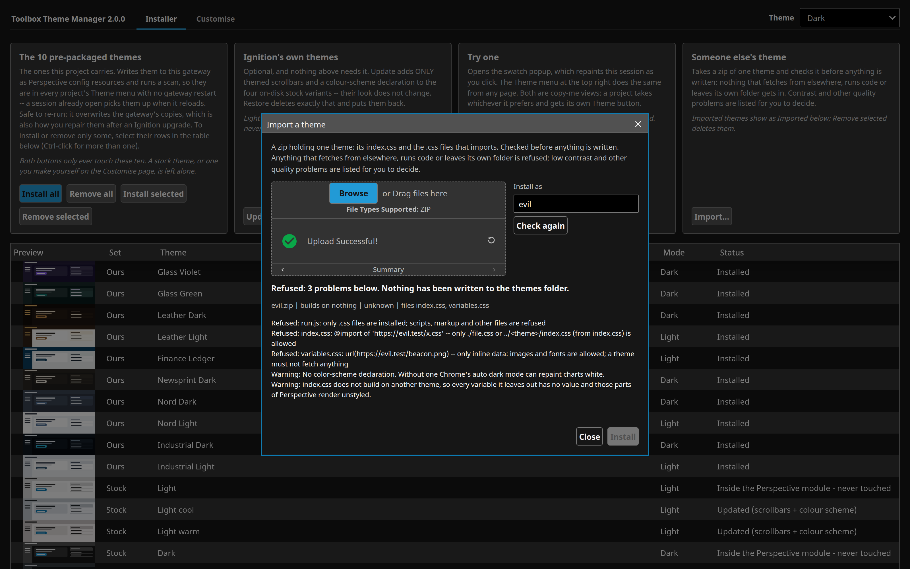
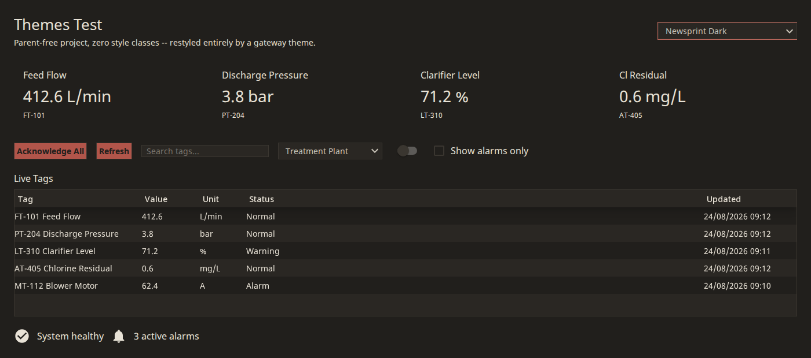
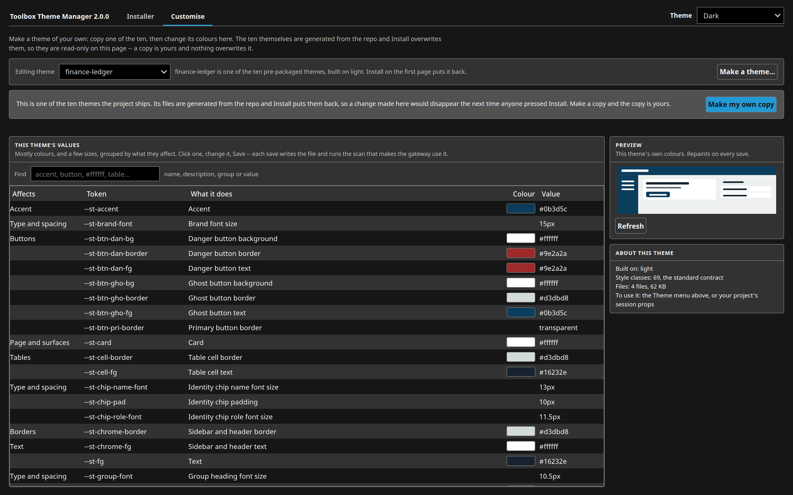
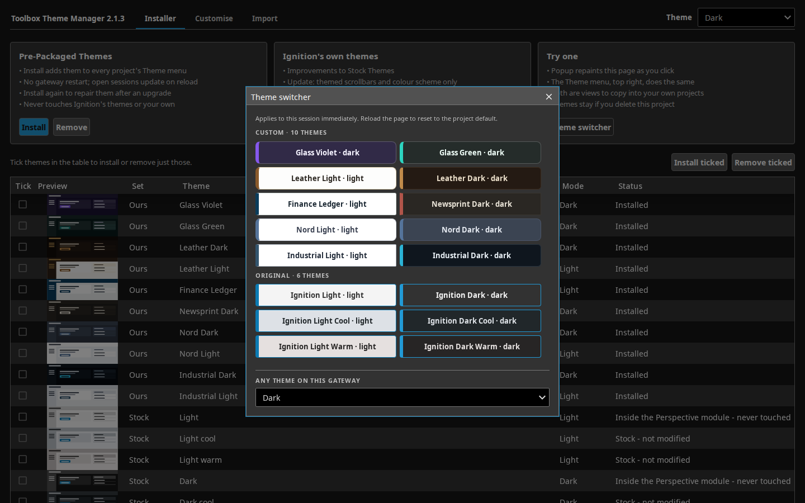

# Toolbox Theme Manager

Ten Perspective gateway themes, and a Perspective project that installs, removes, customises and imports themes, one at a time or all at once.

> **Not an Inductive Automation product, and not supported by Inductive Automation.** Independent work, largely built with AI tools and tested for one purpose on a limited subset of gateway versions and platforms. Take the ideas; fork and review it before it goes near production. Feedback is welcome in Issues; improvements are made where possible, but no support is guaranteed. [NOTICE.md](NOTICE.md) says more.

## Why this exists

Stock Ignition gives a Perspective session six themes, all variations on the same two. A theme is a gateway config resource: a folder of CSS under the gateway's data directory that restyles every stock component in every project, with no parent project or style classes. Putting one there normally means shell access and a config scan. This project carries ten themes and does the installing from a page. It also takes a theme someone else made as a zip and checks it first, because a theme is CSS that every session on the gateway loads.

## What it looks like



The Installer tab. Install and Remove do all ten; tick themes in the table and use Install ticked or Remove ticked to act on just those. Ignition's own themes, themes made on Customise and imported themes are listed too.



The Import tab with a theme zip that passed the safety checks. Install is enabled, and the contrast pairs under WCAG 2.1 AA are listed for the admin to weigh up.



A zip that fetches a stylesheet from another server, sends a request to a tracking address and carries a script. Each reason is listed, Install stays disabled, and nothing has been written to the themes folder.

| Glass Violet | Newsprint Dark | Finance Ledger |
|---|---|---|
|  |  |  |

Three of the ten themes, each restyling the same stock components.



Customise: copy one of the ten and change its colours, with a preview that repaints on every save.



The copy-me swatch popup, listing the themes installed on the gateway it runs on.

## What it does

| Theme id | Label | Look | Mode |
| --- | --- | --- | --- |
| `glass-violet` | Glass Violet | translucent glass panels over a violet/blue/green/pink gradient field | dark |
| `glass-green` | Glass Green | translucent glass over a near-black green/teal field, bright mint accent | dark |
| `leather-dark` | Leather Dark | warm tan leather and dark paper | dark |
| `leather-light` | Leather Light | warm tan leather and parchment | light |
| `finance-ledger` | Finance Ledger | restrained ledger/spreadsheet look | light |
| `newsprint-dark` | Newsprint Dark | newsprint greys and ink on a dark page | dark |
| `nord-dark` | Nord Dark | the Nord palette, dark mode | dark |
| `nord-light` | Nord Light | the Nord palette, light mode | light |
| `industrial-dark` | Industrial Dark | industrial control-room cyan, dark mode | dark |
| `industrial-light` | Industrial Light | industrial control-room cyan, day mode | light |

Each theme sets 110 of the gateway's 120 built-in theme variables, declares `color-scheme` for its own mode so Chrome's auto dark mode does not repaint chart SVGs white, and publishes a 69-class `st/...` style-class contract a project can build on. Every theme meets WCAG 2.1 AA contrast for text, control edges and alarm rows, draws a 2px focus ring, and honours reduced motion; the build fails if one drops below. See [docs/THEMES-INTERNALS.md](docs/THEMES-INTERNALS.md).

| Tab / action | What happens on the gateway |
| --- | --- |
| Installer: Install / Remove | Writes or deletes all ten under `config/resources/core/com.inductiveautomation.perspective/themes/`, with one config scan. No restart. Re-running Install repairs a damaged copy. |
| Installer: Install ticked / Remove ticked | The same for the ticked themes only. Remove ticked also deletes imported themes. Ignition's own themes and themes made on Customise are never touched. |
| Installer: Update / Restore | Optional. Adds themed scrollbars and a `color-scheme` line to Ignition's four on-disk stock variants without changing their look, and takes them back off. |
| Customise | Makes a theme of your own from one of the ten and edits its colours. |
| Import | Checks a theme zip, shows the verdict and a preview, and installs it only if nothing was refused. |
| Theme switcher | Two copy-me views, `SelectorPopup` and `ThemeDropdown`, that list whatever themes the gateway has. The popup's text meets WCAG 2.1 AA in all sixteen themes, Ignition's six included. |

### What an import may contain

A zip of one theme: `index.css` and any `.css` files it imports, either at the top of the zip or in one folder. `README`, `LICENSE`, images, `config.json` and `resource.json` are left out; the last two are written fresh. The theme id comes from the folder or zip name and can be changed before installing.

| Refused | Listed as a warning |
| --- | --- |
| Any file other than `.css`; sub-folders; paths with `..`, absolute paths, symbolic links, encrypted entries | Text or control-edge colours under WCAG 2.1 AA (4.5:1 text, 3:1 edges) on the three container surfaces, worked out with what the theme inherits |
| `url()` to anything but an inline `data:` image or font; `image-set()` | No `color-scheme` declaration |
| `@import` other than `./file.css` in the zip, or `../<theme>/index.css` from `index.css` to a theme the gateway has | Building on nothing, or on a theme other than Ignition's own |
| `expression()`, `javascript:`, `vbscript:`, `-moz-binding`, `behavior:`, `</`, `@namespace`, `@document` | Text added with `content:` |
| Backslash escapes of letters or hex codes, which could spell `url(` unseen; an unclosed comment | |
| Not UTF-8; a zip over 2 MB, a file over 1 MB or 3 MB in all; over 40 entries | |
| An id that is already a theme on the gateway | |

The upload is kept on the gateway, and Install checks that copy again, so what is installed is what was checked. An imported theme's `resource.json` records the zip name, its SHA-256 and the date.

## How to use it

1. Gateway web UI → **Config → Projects → Import**, pick `Toolbox_Theme_Manager-<version>.zip` from the latest release.
2. Open `<gateway>/data/perspective/client/Toolbox_Theme_Manager`.
3. Press **Install**, or tick themes and press **Install ticked**. The status column changes to Installed a couple of seconds later.
4. To bring in someone else's theme, open the **Import** tab, drop the zip on the box, read the findings, then press **Install**.

The project has no parent, no database and no tag provider, and runs on any 8.3 gateway. Deleting it leaves the themes in place; they are gateway config, not project resources.

Without the project: unzip `toolbox-themes-<version>.zip` from the same release and run `./install.sh --data-dir <dir>`, `--docker <container>` or `--ssh <host> --data-dir <dir>`, then **Config → Platform → Overview → Scan File System**. A session picks a theme through `session.props.theme`. To reach `dark` or `light` from a theme whose id ends `-dark` or `-light`, set `dark-cool` or `light-cool` first and the theme more than 100 ms later, as the switcher popup does: Perspective does not load `dark.css` while `industrial-dark.css` is loaded.

---

## Building from source

The project sits at the repo root and is generated; edit the generators, not the `view.json` files.

```bash
python3 tools/themes/build_theme.py    # the ten themes, from tools/themes/packs/ -> tools/themes/out/
python3 tools/build_manager.py         # the project, from tools/themes/out/
python3 tools/test_import.py           # import checks: 40 zips, good and bad
tools/package.sh --release             # dist/Toolbox_Theme_Manager-<VERSION>.zip and toolbox-themes-<VERSION>.zip
```

`tools/build_manager.py` appends `tools/insight_code.py`, `tools/editor_code.py` and `tools/import_code.py` to the generated `themepack` script. `tools/package.sh` refuses to package if a theme misses WCAG 2.1 AA, and a release needs `VERSION` to match the tag. The themes were developed in the now-archived `project-themes` repo; a gateway with its `Theme_Installer` project can delete it once this one is imported.

## Licence

Apache-2.0. See [LICENSE](LICENSE).
