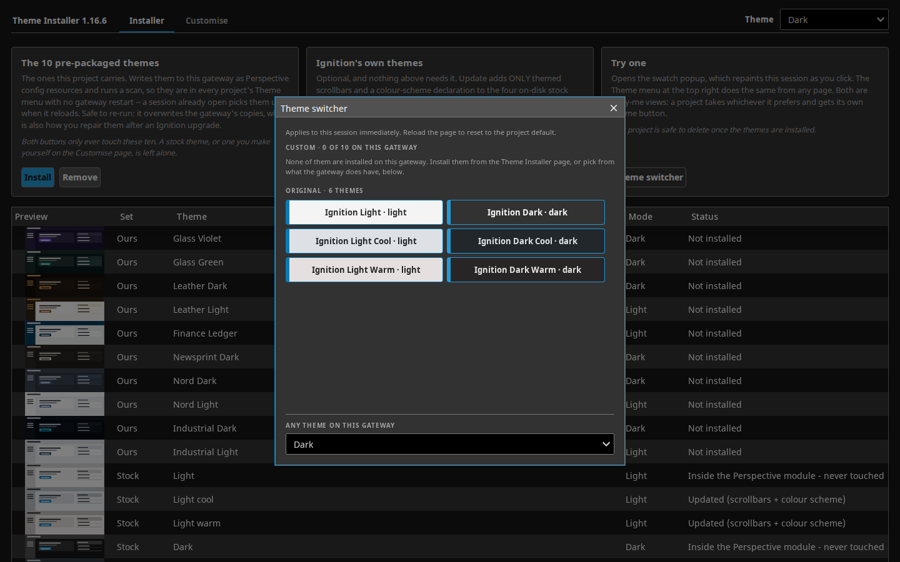

# How these themes are built

The README says what the themes are and how to install them. This is the rest:
what a theme actually covers, the class contract it publishes, how a switcher
view works, and where everything lives. The theme sources are under
`tools/themes/`; paths below are relative to that folder unless they start
with `docs/`.

## Updating the stock themes (optional)

The Installer's Update button adds themed scrollbars and a `color-scheme` line
to Ignition's four on-disk stock variants, as one `theme-additions.css` plus an
`@import` at the end of each `index.css`; Restore removes exactly that.

## Adding a theme switcher

This repo ships **two** in `tools/themes/selector-popup/`, either of which drops into any project to let
a user change their own session's theme, with no parent project and no style
classes:

- **`views/ThemeDropdown`** — one 34px dropdown. Embed it with an Embedded
  View component (`props.path = "ThemeDropdown"`, about 260×34) and that is the
  whole job.
- **`views/SelectorPopup`** — the swatch grid, opened as a popup. Each theme is
  a button in its own colours, so you can see what you are picking.

**Both list the gateway, not this repo.** Each asks
`system.config.getResources(moduleId="com.inductiveautomation.perspective",
typeId="themes")` when it opens, and adds Ignition's stock six as a fixed base
(`light` and `dark` live inside the Perspective module's jar and never appear
as resources). So a switcher copied onto a gateway that has none of these
themes offers that gateway's own themes instead of writing an id Perspective
cannot resolve, and a theme from anywhere else shows up without either file
being edited.

The popup's swatch colours are a fixed hand-verified list — a view binding
cannot read a colour out of a theme's CSS — but a swatch is only *offered*
when the gateway has that theme, the section heading counts what is there,
and when none are, a line says so and points at the dropdown at its foot:



Neither view depends on a script package: the listing is inline in each,
duplicated on purpose so that copying one drags nothing else in.

To use the popup in another project:

1. Copy the whole `views/SelectorPopup` directory into the target project (or
   lift it from `selector-popup/SelectorPopup.view.json` here).
2. Add a button anywhere that calls:
   ```python
   system.perspective.openPopup(
       'theme-selector',
       'SelectorPopup',
       title='Theme switcher',
       modal=True,
       draggable=True,
       resizable=False,
       overlayDismiss=True,
       viewportBound=True,
       position={'width': 560, 'height': 590})
   ```
   `width`/`height` are **not** top-level `openPopup` kwargs on this Ignition
   version — confirmed live and against IA's own scripting reference. They go
   inside `position` as plain pixel integers. `viewportBound=True` keeps the
   frame fully on-screen on a short viewport.

That is it — the popup writes `session.props.theme` itself when a swatch is
clicked; nothing else needs wiring up.

Both views are hand-authored and commit-tracked at
`selector-popup/SelectorPopup.view.json` and
`selector-popup/ThemeDropdown.view.json`.

## What a theme covers

### Variable coverage

Audited 25/08/2026 directly against a live 8.3.8 gateway
(`curl http://<gw>/data/perspective/themes/{dark,light}.css`, every
`--name: value;` enumerated): the flattened theme CSS defines exactly **120**
unique custom properties each. Every theme here covers **110** of them.

Beyond the core ~35 surfaces, borders, ink, accent, status, radius and
elevation variables, the generator derives:

- **Neutral midtones**: `--neutral-40/50/60/70/80`, interpolated (RGB lerp,
  evenly spaced) between the pack's own `--neutral-30` and `--neutral-90` — no
  source token supplies these directly. Added because the audit found ~98
  component rules across `dark.css`/`light.css` reference these *directly*
  (icon fills and strokes, secondary text, hairline borders, SVG symbol
  strokes), not merely as indirection behind variables already covered.
  Leaving them unthemed left a large swath of secondary chrome stock grey
  regardless of theme.
- **Controls**: `--checkbox--checked/unchecked/indeterminate/disabled`,
  `--radio--selected/unselected/disabled`,
  `--toggleSwitch--selected/unselected`,
  `--progressLinearBar--determinate/indeterminate`,
  `--progressLinearTrack--determinate/indeterminate`. All names confirmed
  against the live CSS — an earlier pass guessed `--radio--checked/unchecked/
  indeterminate` and `--toggleSwitch--on/off/disabled` by symmetry with
  `--checkbox--*`; the real names differ, and there is no
  `--radio--indeterminate` or `--toggleSwitch--disabled` at all.
- **Status secondaries**: `--warningSecondary`, `--infoSecondary` — `--warning`
  and `--info` re-emitted as a 16%-alpha wash.
- **P&ID symbols**: `--symbolFill--default/running/faulted/stopped` and
  matching `--symbolStroke--*` (the fill darkened 20%, for a visible outline
  against its own fill; `default` reuses `--containerBorder`).
  `--symbolFillAnimation--default/running` reuse `--neutral-80`, as IA's own
  values for both do.
- **Native pipes**: `--pipeStroke`, `--pipePrimaryFill`, `--pipeSecondaryFill`,
  `--pipeSelectStroke`.
- **Chart scales**, generated algorithmically (standard-library `colorsys`, not
  read from any source pack — none defines a 10/16/6-step scale), anchored on
  the theme's own final `--callToAction`/`--error`/`--neutral-10`, and
  deterministic:
  - `--qual-1..10`: ten hues rotated evenly around the wheel, `--qual-1` being
    the accent hue itself; lightness ~65% / saturation 60% on dark themes,
    ~46% / 60% on light.
  - `--seq-1..6`: a monotonic ramp of the accent hue, weak → strong.
  - `--div-1..16`: a diverging ramp from the accent hue through a neutral
    midpoint matched to the page to the error hue.
  - Every `--qual-*` is checked (warn-only) for contrast ≥1.5 against
    `--neutral-10` and RGB distance ≥40 from its neighbour, wraparound
    included. All ten themes pass with zero chart-scale warnings.
- **Two variables IA's own themes never define at all**:
  `--tooltip-background-color` and `--arrow-color` are referenced by
  `.ia_form__tooltip-*` rules via `var()` with no fallback and no `:root`
  value anywhere in IA's CSS, so a stock tooltip's background and arrow are
  effectively unset. Every theme here gives them a real value.
- **Misc**: `--boxShadow--inset`, `--indicator` and `--indicatorOff` (the LED
  component's diode and the quality-overlay pending state),
  `--contextBackground`, `--defaultSliderFocusColor`,
  `--callToAction--activeAlt` and `--activeAltInvis`.

**Deliberately left inherited** — the remaining 10 of the 120, geometry or
pure IA brand constants rather than colours a theme should own: `--white`,
`--black`, `--font-NotoSans`, `--opacity-25/50/85`, `--red-10/20/30/50/60`,
and `--defaultSliderFocusBoxShadow` (a pure blur/spread value with no colour
component — its colour half, `--defaultSliderFocusColor`, *is* themed).

### Compensating rules for hard-coded IA colours

The same audit scanned the live flattened CSS for colour literals applied
directly to a component selector rather than through a variable. A handful of
IA's own rules bypass the variable system entirely, so **no** theme — IA's own
built-in ones included — can reach them by overriding `variables.css` alone.
Each theme's `globals.css` adds three targeted compensating rules, judged
common, visible and low-risk enough to be worth it — the same selectors IA
itself defines, at the same alpha steps, just with the theme's own accent:

- **`::selection`** — IA's `dark.css` hard-codes a fixed dark blue and
  `light.css` defines none at all (browser default). Tinted with the theme's
  own accent at 0.35 alpha.
- **`.ia_slider__handle:focus`** — hard-codes its own blue `color` directly
  rather than reading `--defaultSliderFocusColor`, the way IA's *other* slider
  implementation does. Swapped to read the variable properly.
- **Table row hover and selection** (`.ia_tableComponent__body__row--hovered`,
  `.ia_tableComponent__selection`, `.ia_alarmJournalTableComponent__selection`,
  `.ia_alarmStatusTableComponent__selection`) — the highest-traffic hard-code
  found, since every table hits it. `!important` here because IA's own
  declarations carry the same specificity and would otherwise win on source
  order alone from within the same imported base stylesheet.

Separately, and by the same `globals.css` mechanism, **scrollbars follow the
theme**: `scrollbar-color` and the `::-webkit-scrollbar-*` rules use the
theme's own `--containerBorder` for the thumb and `--callToAction` on hover,
since stock themes leave scrollbars at browser default regardless of theme.

### The occlusion-fix rule

Every `globals.css` emits, alongside the page background:

```css
#app-container .center.view-parent > .view.ia_container--root {
  background-color: transparent !important;
}
```

Perspective's own top-level view root — the element carrying both `.view` and
`.ia_container--root` — paints itself opaque with the theme's own
`--containerRoot`, one level inside `#app-container`. That is stock behaviour
for any `ia_container--primary` root container, not a bug in any project's
view JSON, and it hides the page background on every ordinary page in every
theme unless punched through. The selector is a structural Perspective shell
pattern rather than something specific to one theme, so the fix generalises
unchanged across all ten.

### Accessibility

Every theme meets WCAG 2.1 AA for colour, focus and motion. The pack's
colours are the starting point. Where a colour misses a threshold, the
generator changes its lightness only (hue and saturation kept) until it
passes, and prints an `A11Y` line for each colour it moved.

| What | Threshold | Checked against |
|---|---|---|
| `--label`, `--label--disabled`, `--error`, `--warning`, `--success`, `--info` | 4.5:1 | page, card and nested-card surfaces |
| Primary button text (`--a11y-button-text`) | 4.5:1 | `--callToAction` and its hover and pressed shades |
| Input, dropdown, checkbox, radio and toggle edges (`--a11y-input-edge`) | 3:1 | the three surfaces and `--input` |
| Keyboard focus ring (`--a11y-focus-ring`) | 3:1 | the three surfaces and the table's own surfaces |

The severity colours are adjusted in place because stock components use
them directly as text (`.ia_form__error`, the alarm table footer, file upload
messages); a separate text token would never reach those components.

**Primary button text.** A stock primary button puts `--neutral-10` on the
accent. When that pairing misses 4.5:1, the build switches the text to
whichever of white or black reads better, then moves the hover and pressed
shades away from the text until they pass as well.

**Borders.** `--border` and `--containerBorder` stay hairlines, because cards,
dividers and chart frames use them. Only the edges that show a control
exists are raised to 3:1.

**Focus ring.** It is 2px wide:

- on `:focus-visible`;
- on the dropdown box, because the dropdown turns its own search input's
  outline off;
- inset on the table grid, which turns its own outline off.

**Reduced motion.** `prefers-reduced-motion: reduce` cuts every animation and
transition to 0.01ms. That includes project alarm pulses. A near-zero
duration still fires `animationend` and `transitionend`, so scripts waiting
on those events keep working.

`tools/check_contrast.py` reads each generated theme as the gateway serves it
and checks every pair above, plus the contract's own text pairs. It prints
each pair it could not check. `package.sh` will not package a failing theme.

`alarms/text` and `alarms/time` are each a single colour shared by all four
`alarms/row-<severity>` classes, and `alarms/pri-<severity>` is a badge
colour painted on its own row -- none of that is covered by the pairs above,
because a row's rendered background depends on which severity classes land
on it. `tools/check_alarm_contrast.py` reads each generated theme's alarm
classes and checks text/time (4.5:1) and the badge (3:1) against each of the
four rows' own composited background. `package.sh` will not package a
failing theme.

Some failures are Perspective's own markup, and no theme can fix them:

- the page has no `lang` attribute;
- the Table's grid roles are incomplete;
- the checkbox and dropdown-search inputs have no labels.

## The style-class contract

A theme is CSS only, and the conventional reading is that it therefore cannot
ship Perspective style classes. The first half is true; the conclusion is not,
and the difference is what lets a project drop a look-and-feel parent
entirely.

**Perspective emits whatever string sits in `style.classes` into the DOM as a
`psc-<string>` class, resource or no resource.** So a theme's `globals.css` —
just CSS served gateway-wide — can define `.psc-st\/containers\/card` and carry
a whole semantic class contract. What is lost is only the Designer's
style-class picker dropdown, which costs nothing for a UI that is generated
rather than hand-assembled.

`build_contract.py` appends that payload to each theme's `globals.css`, in
cascade order:

1. the theme's 40 `--st-*` tokens, hoisted to `:root`;
2. `contract/chrome.css` verbatim — component chrome, shell and card grid,
   written against `[class*="/family/name"]` attribute selectors;
3. the 69-class contract, from each class's own definition.

Two things worth knowing if you build on it or extend it:

**Keep the slashes.** `st/containers/card`, not `st-containers-card`. Part 2 is
keyed on `[class*="/tables/frame"]`-style attribute selectors, and slash names
let 585 lines of chrome port byte for byte.

**Double the selector; never use `!important`.** A theme loads *before* IA's
own `PerspectiveComponents.css`, whereas a project style-class bundle loads
*after* it — so moving a contract into a theme flips it from winning ties to
losing them. Measured: `buttons/chip` silently dropped its `padding: 0 12px`
to IA's `0`. `!important` fixes that but also beats *inline* styles, which
inverts Perspective's own precedence and breaks every per-component override
(measured: it forced topbar and sidebar padding over the components' own
props). Doubling the class — `.psc-st\/x\/y.psc-st\/x\/y`, specificity 0-2-0 —
beats IA's 0-1-0 component rules and still loses to inline, which is exactly
how a real style class behaves.

## Installing the files by hand

`tools/themes/install.sh --data-dir <dir>`, `--docker <container>` or
`--ssh <host> --data-dir <dir>` copies every theme folder into
`<data-dir>/config/resources/core/com.inductiveautomation.perspective/themes/`,
and refuses to touch Ignition's own six. Then run **Config → Platform →
Overview → Scan File System**. Uninstall by deleting the folders and scanning
again. The release's `toolbox-themes-<version>.zip` carries the same files.

## Selecting a theme by hand

Bind `session.props.theme` (session-wide) or call
`system.perspective.setTheme()` (page only). `out/themes.json` lists each
theme's id, label and mode for building a picker.

## The glass-green tweak

`glass-green` (source pack `aurora-teal`) originally read as *violet with a
teal accent* rather than a genuine green-glass theme. Root cause: the pack's
`surface.page`/`surface.card`/`surface.sidebar` tokens were never diverged
from `aurora-violet` when the pack was cloned — both packs' `surface.page` is
the literal `"#1a1233"`, violet. Only the accent-adjacent tokens actually
changed. A stylesheet-based renderer never showed this, because it reads
`containers/page`'s *effective* `backgroundColor` override (already a correct
dark teal) rather than the raw `surface.page` token; this generator reads the
raw token, which is what let the violet leak through into a *theme*
specifically.

Fixed entirely in `mapping.TWEAKS["glass-green"]` — `packs/aurora-teal.json`
is untouched. The tweak recomputes the surface stack from a new near-black
green-tinted base (`#0d1412`) using the pack's own existing translucent
white-glass alpha values, so the *glass effect* is unchanged and only what it
sits on differs, and moves the accent from the pack's muted teal (`#0f766e`)
to a brighter mint (`#2dd4bf`, hover `#5eead4`, active `#26b4a2`) with a fresh
green `--success`. Every downstream variable that `ref:`s the accent, plus the
chart scales and the compensating rules, inherits the fix automatically.
`glass-violet` has no tweak and is unmodified.

## What is where

- `packs/` — the ten source colour packs, each a JSON token set.
- `mapping.py` — the curated token → built-in-Perspective-variable table, in
  three parts (read its module docstring for the full grammar):
  - `MAPPING`, the core ~35 IA variables, resolved straight from a pack;
  - `EXTENDED_MAPPING`, a second pass resolved after `MAPPING` and any
    `TWEAKS`, so it can `ref:` the final values;
  - `TWEAKS`, per-theme literal overrides — data, not code — applied between
    the two passes. Only `glass-green` has an entry today.
- `build_theme.py` — the generator: resolves `MAPPING` against the pack,
  applies `TWEAKS[id]`, resolves `EXTENDED_MAPPING`, generates the three chart
  scales, writes `out/<id>/`.
- `build_contract.py` — appends the `--st-*` / `st/...` contract payload to
  each theme's `globals.css`. Its inputs are vendored under `contract/`.
- `out/<theme-id>/` — the ten generated theme directories, each with
  `config.json`, `index.css`, `variables.css`, `globals.css` and
  `resource.json`. This is exactly what gets deployed to
  `data/config/resources/core/com.inductiveautomation.perspective/themes/<id>/`.
- `selector-popup/` — the two copy-me switcher views as hand-authored JSON.
- `tools/check_contrast.py`, `tools/check_alarm_contrast.py` — the WCAG 2.1
  AA gates `tools/package.sh` runs before packaging.
- `install.sh`, `RELEASE-README.md` — the install-without-the-project route
  and the readme packed beside it in `toolbox-themes-<version>.zip`.
- `docs/THEMES-EVALUATION.md` — the evaluation this project grew out of: what
  a theme can and cannot reach, whether themes paint earlier than a project
  stylesheet, and what a look-and-feel parent still buys on top of one.

`resource.json` deliberately carries no `lastModification` or
`lastModificationSignature`. The gateway must stamp those itself on first
scan — a hand-written signature that does not match the content makes the
config scan **silently** skip the resource.
